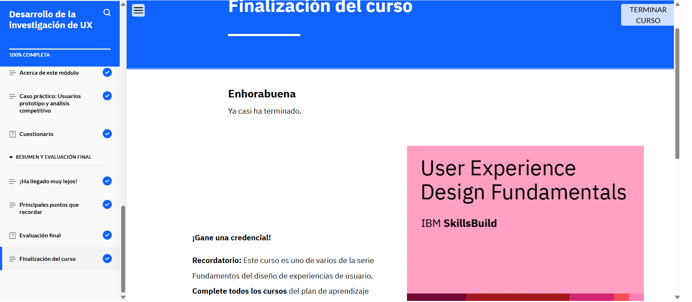

# Desarrollo de la investigación de UX

## Acerca de esta actividad formativa

En este curso, aprenderá la importancia de la investigación en la creación de un diseño centrado en el usuario. Analizará diversos métodos y técnicas de investigación de la experiencia de usuario (UX). También aprenderá la importancia de los usuarios prototipo en el diseño de UX y las formas de crearlos basándose en la investigación realizada y los datos recopilados. También aprenderá a realizar un análisis competitivo y comparativo evaluando y comparando un producto o servicio con sus competidores en el mercado. Por último, analizará un ejemplo de caso práctico de UX en el que se llevó a cabo una investigación y se crearon usuarios prototipo.

## Lo que aprenderá

Después de completar este curso, debería poder:

- Describir la importancia de la investigación de usuarios en el diseño de UX.
- Explicar el objetivo y la importancia de las hipótesis en la investigación de UX.
- Identificar los métodos y técnicas utilizados para llevar a cabo una investigación de UX.
- Describir el objetivo y la importancia de la síntesis de datos.
- Explicar los distintos marcos para sintetizar los datos de una investigación de UX.
- Explicar la finalidad, la importancia y los principales componentes de los usuarios prototipo.
- Describir el proceso de creación de un usuario prototipo.
- Describir el proceso de utilización de usuarios prototipo durante el proceso de diseño de UX.
- Explicar los análisis competitivo y comparativo.
- Identificar los pasos y marcos comunes para llevar a cabo un análisis competitivo y comparativo.
- Analizar un ejemplo de caso práctico de UX para sacar conclusiones sobre la investigación de usuarios, la creación de usuarios prototipo y la investigación de la competencia.

