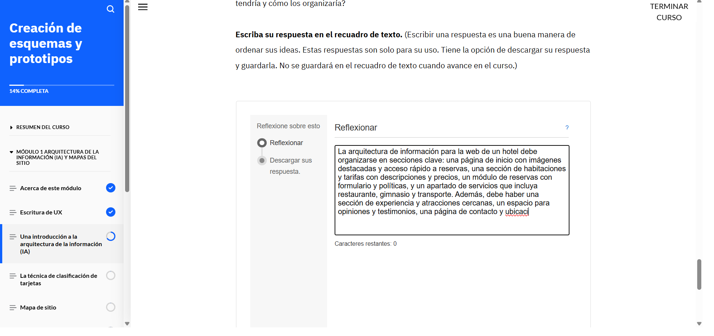
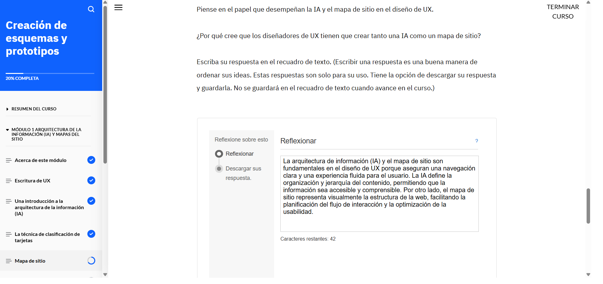
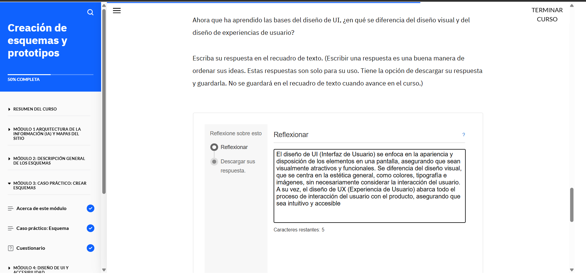
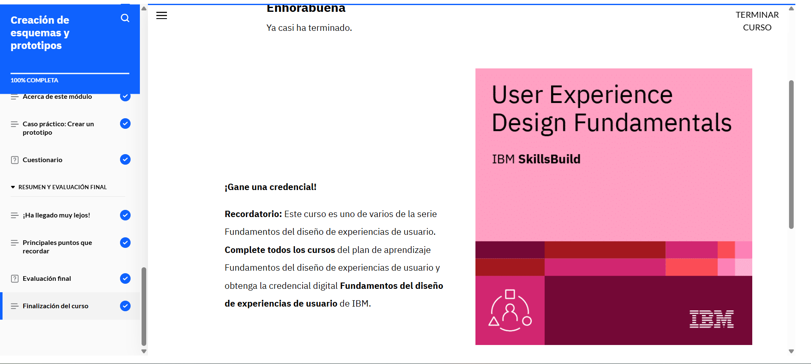
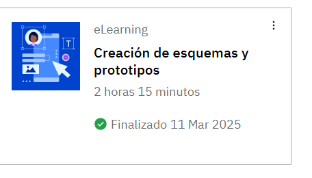

# Creación de esquemas y prototipos

## Acerca de esta actividad formativa

En este curso, aprenderá sobre la escritura de UX, la arquitectura de la información (IA) y los mapas de sitio y su papel en el diseño de UX. Analizará el proceso de creación de esquemas, su finalidad y los tres tipos de esquemas. Luego, revisará un ejemplo de caso práctico que muestra esquemas para un sitio web de comercio electrónico de venta de plantas. A continuación, conocerá los principios fundamentales del diseño de interfaces de usuario (UI) y la forma en que mejoran la accesibilidad de los productos digitales. También aprenderá sobre el proceso de creación de prototipos y su importancia en el diseño de UX. Por último, analizará un ejemplo de caso práctico que muestra el diseño de la interfaz de usuario y los prototipos para un sitio web de comercio electrónico de venta de plantas.

## Lo que aprenderá

Después de completar este curso, debería poder:

- Explicar la escritura de experiencias del usuario (UX) y las buenas prácticas para una escritura de UX eficaz.
- Definir la arquitectura de la información (IA) y su finalidad en el proceso de diseño de UX.
- Describir un mapa de sitio y los pasos para crearlo.
- Explicar un esquema y su finalidad.
- Describir las fidelidades de los esquemas.
- Analizar un ejemplo de caso práctico de diseño de UX para sacar conclusiones sobre cómo crear la IA, un mapa de sitio y esquemas.
- Describir el diseño de la interfaz de usuario (UI) y sus principios.
- Identificar los objetivos y las buenas prácticas para garantizar la accesibilidad de los productos digitales.
- Explicar las técnicas de creación de prototipos.
- Describir la importancia de la creación de prototipos en el diseño de UX.
- Analizar un ejemplo de caso práctico de diseño de UX para sacar conclusiones sobre cómo crear el diseño de UI y prototipos.

