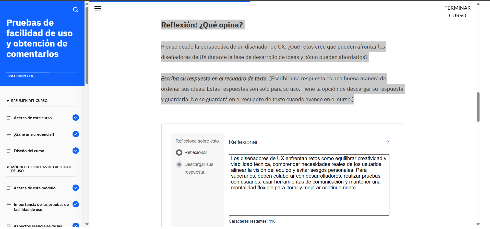
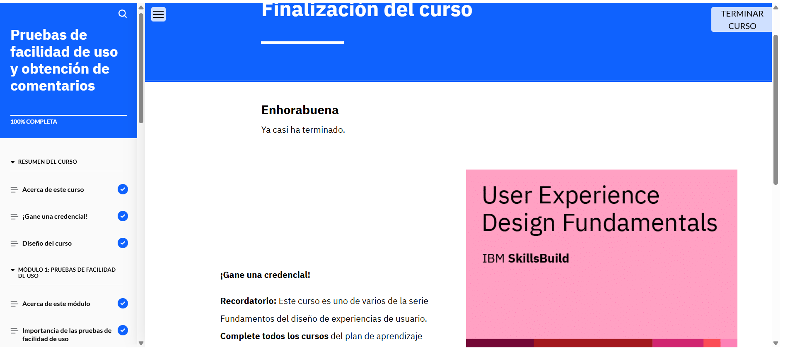
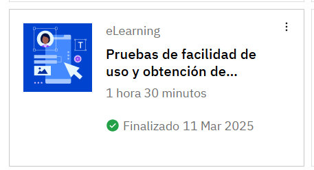

# Pruebas de facilidad de uso y obtención de comentarios

## Acerca de esta actividad formativa

En este curso, aprenderá cómo los diseñadores de UX evalúan sus diseños mediante pruebas de facilidad de uso. Identificará los distintos métodos para llevar a cabo pruebas de facilidad de uso y los pasos del proceso para realizar estas pruebas. También aprenderá cómo priorizan los diseñadores la información que obtienen de las pruebas de facilidad de uso. También descubrirá cómo estos comentarios ayudan a mejorar los diseños mediante la creación de un prototipo revisado. Por último, analizará un ejemplo de caso práctico de diseño de UX que muestra un plan de pruebas y herramientas para la prueba de facilidad de uso, el informe de análisis de las pruebas y un prototipo revisado para un sitio web de comercio electrónico de venta de plantas.

## Lo que aprenderá

Después de completar este curso, debería poder:

- Explicar la importancia, los objetivos y los principales elementos de las pruebas de facilidad de uso.
- Diferenciar entre pruebas de facilidad de uso cualitativas y cuantitativas.
- Describir los distintos métodos cualitativos y cuantitativos de realizar pruebas de facilidad de uso.
- Describir el proceso de pruebas de facilidad de uso.
- Describir la evaluación heurística.
- Identificar herramientas comunes para realizar pruebas de facilidad de uso.
- Explicar los distintos niveles de gravedad y la matriz impacto-esfuerzo para priorizar problemas.
- Describir el proceso de recabar e incorporar comentarios sobre facilidad de uso para ultimar los diseños de UX.
- Revisar un ejemplo de caso práctico de diseño de UX para sacar conclusiones sobre la creación de un plan de pruebas de facilidad de uso, el análisis de los comentarios y su documentación en un informe, y la revisión del prototipo.

