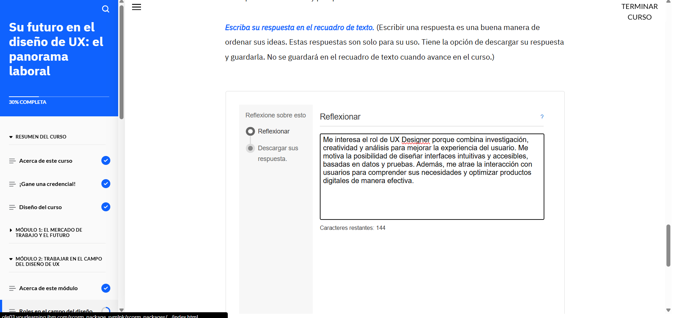
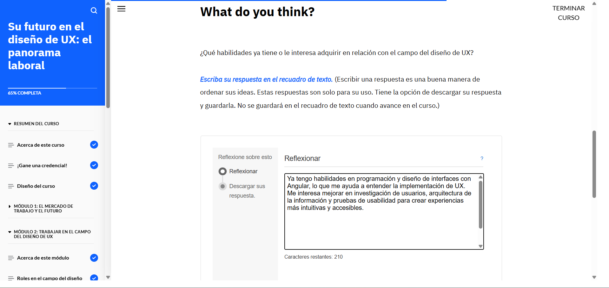
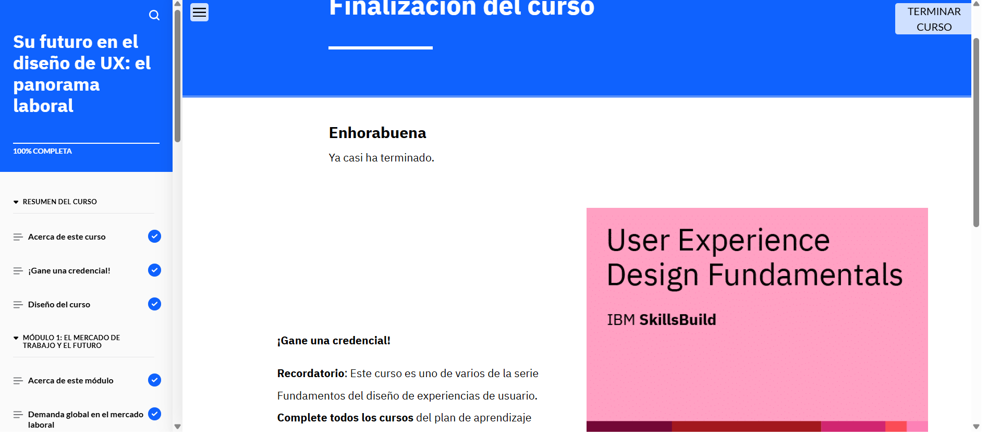

# Su futuro en el diseño de UX: el panorama laboral

## Acerca de esta actividad formativa

En este curso, aprenderá sobre el mercado laboral del diseño de UX, las competencias que necesitan los diseñadores de UX para tener éxito y las responsabilidades de los diseñadores de UX. También descubrirá en qué se diferencian los diseñadores de UX del resto de diseñadores. Además, encontrará recursos y oportunidades de aprendizaje para poder explorar más.

## Lo que aprenderá

Después de completar este curso, debería poder:

- Identificar los sectores en los que trabajan los diseñadores de UX.
- Conocer la demanda global de diseñadores de UX en el mercado laboral.
- Conocer el futuro del campo del diseño de UX.
- Identificar roles comunes en el campo del diseño de UX.
- Explicar las principales responsabilidades de un diseñador de UX.
- Identificar las competencias que necesitan los diseñadores de UX.
- Identificar recursos para aprender más y estar siempre al día en el campo del diseño de UX.

