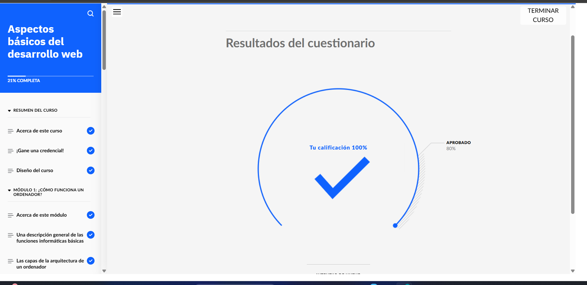
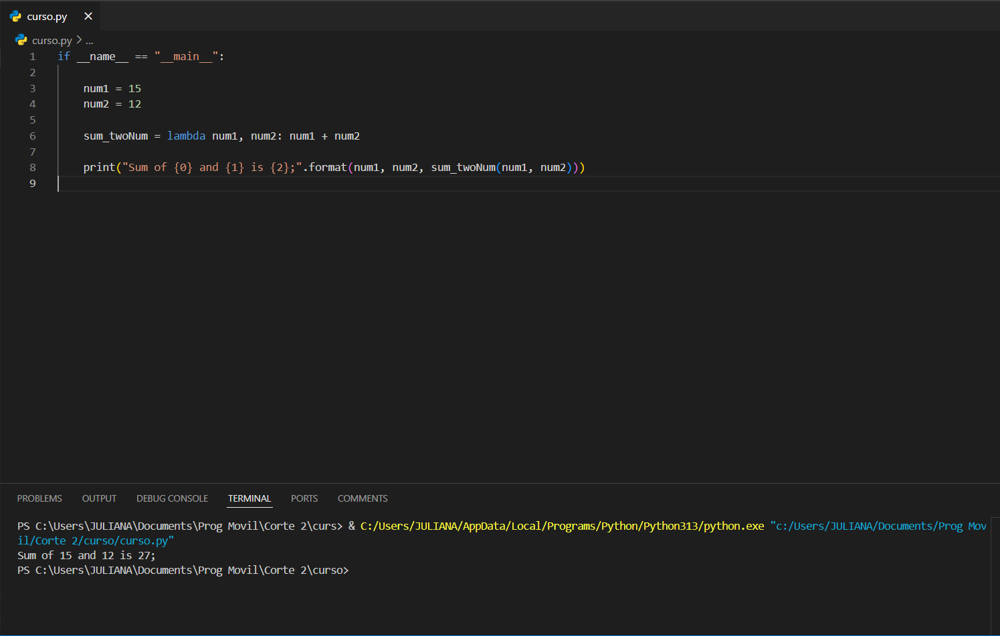
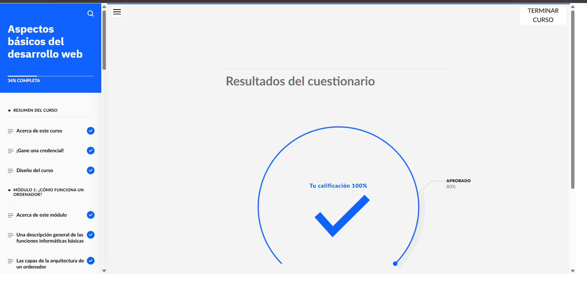
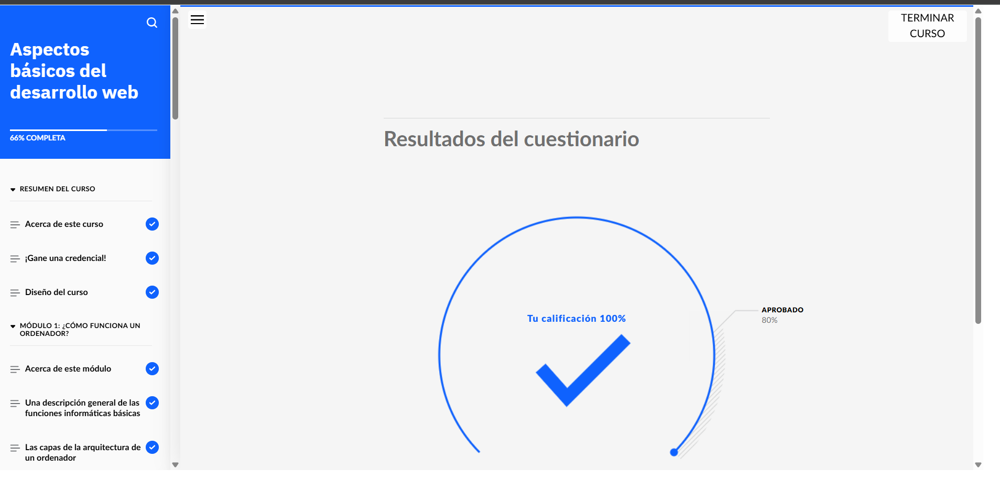
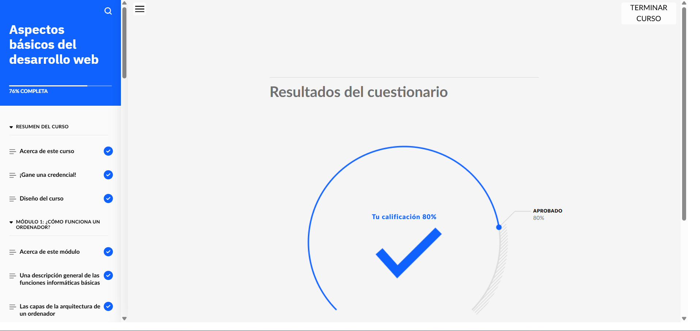
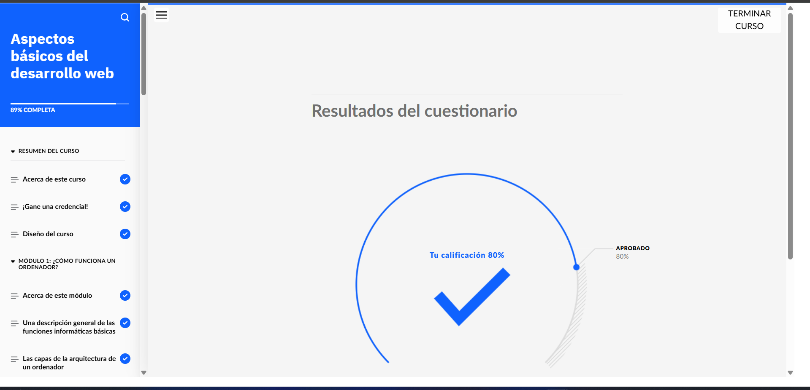
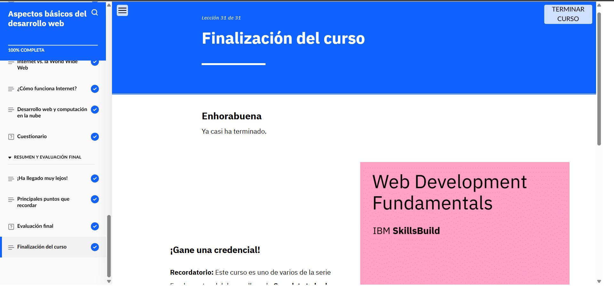

# Aspectos básicos del desarrollo web

# Acerca de esta actividad formativa

## Acerca de esta actividad de aprendizaje

Bienvenido a esta experiencia de aprendizaje diseñada para brindarte una sólida introducción al mundo de la informática y el desarrollo web. En este curso no solo aprenderás conceptos teóricos, sino que también te familiarizarás con las herramientas y lenguajes fundamentales que impulsan la tecnología que usamos a diario.

A lo largo del curso, exploraremos los componentes esenciales de los sistemas informáticos, conocerás los distintos lenguajes de programación y comprenderás cómo se construyen los sitios web modernos desde cero. Este viaje educativo está pensado para proporcionarte una visión integral del desarrollo web, tanto en el lado del cliente (front-end) como en el lado del servidor (back-end).

Además, abordaremos conceptos clave como la diferencia entre la Internet y la World Wide Web, así como el papel que desempeña la nube en la evolución del desarrollo de software.

---

## Lo que aprenderás

Al finalizar este curso, estarás en capacidad de comprender y explicar una serie de conceptos fundamentales que te servirán como base para estudios más avanzados en tecnología. En concreto, podrás:

- **Describir las funciones básicas de un sistema:** Entenderás cómo interactúan los componentes principales de un sistema informático, desde la ejecución de instrucciones hasta la gestión de tareas internas.

- **Diferenciar entre hardware y software:** Serás capaz de identificar qué partes de una computadora son tangibles (hardware) y cuáles son instrucciones que guían su funcionamiento (software).

- **Describir los tipos de lenguajes de programación:** Conocerás la clasificación de los lenguajes, desde los de bajo nivel hasta los más usados en la actualidad como Python, Java o JavaScript, y sabrás en qué contextos se utilizan.

- **Explicar cómo un sistema lee el código:** Analizarás cómo las computadoras interpretan y ejecutan el código fuente que los desarrolladores escriben, pasando por compiladores e intérpretes.

- **Diferenciar entre diseño web y desarrollo web:** Entenderás que diseñar una página no es lo mismo que programarla. Mientras uno se enfoca en la estética y experiencia de usuario, el otro se concentra en la funcionalidad y lógica interna.

- **Identificar los componentes de un sitio web:** Aprenderás sobre la estructura básica de una página, incluyendo HTML, CSS y JavaScript, así como otros elementos fundamentales para su funcionamiento.

- **Explicar los pasos principales del proceso de desarrollo web:** Desde la planificación hasta el despliegue, conocerás las fases que implica construir un sitio web profesional.

- **Diferenciar entre los procesos del lado del cliente y los del lado del servidor:** Sabrás quién hace qué en una aplicación web: lo que sucede en el navegador del usuario (front-end) y lo que ocurre en el servidor que responde a las peticiones (back-end).

- **Identificar las áreas principales y los lenguajes más comunes para el desarrollo front-end:** Descubrirás herramientas y tecnologías como HTML, CSS, JavaScript, frameworks como React o Angular, y entenderás su propósito en el diseño de interfaces dinámicas.

- **Identificar las áreas principales y los lenguajes más comunes para el desarrollo back-end:** Aprenderás sobre servidores, bases de datos y lenguajes como Java, Python o Node.js que permiten crear la lógica detrás de una aplicación web.

- **Diferenciar entre la World Wide Web e Internet:** Comprenderás que la web es solo una parte de la Internet, y conocerás cómo ambas se relacionan y se diferencian.

- **Explicar cómo la nube beneficia al desarrollo web:** Explorarás cómo los servicios en la nube han transformado la forma de crear, alojar y escalar aplicaciones, brindando más flexibilidad y eficiencia.

---

Este curso ha sido diseñado pensando en personas que quieren dar sus primeros pasos en la informática o el desarrollo web. No se requiere experiencia previa, solo curiosidad, motivación y ganas de aprender. ¡Prepárate para comenzar tu camino en el fascinante mundo de la tecnología!

