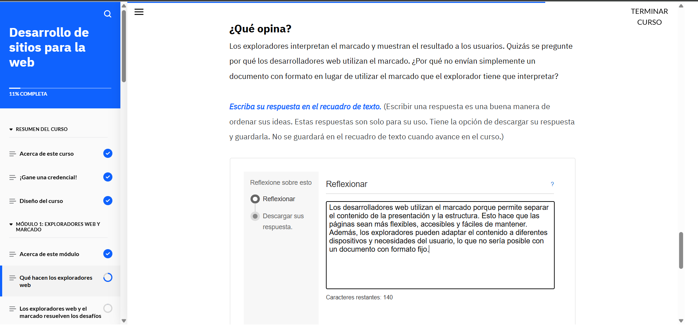
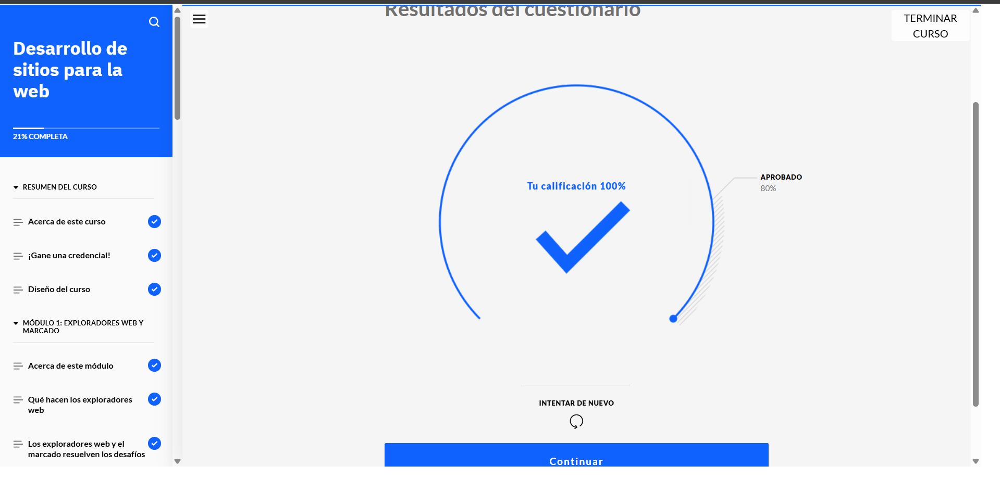
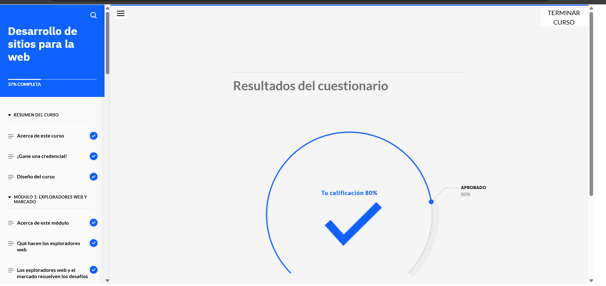
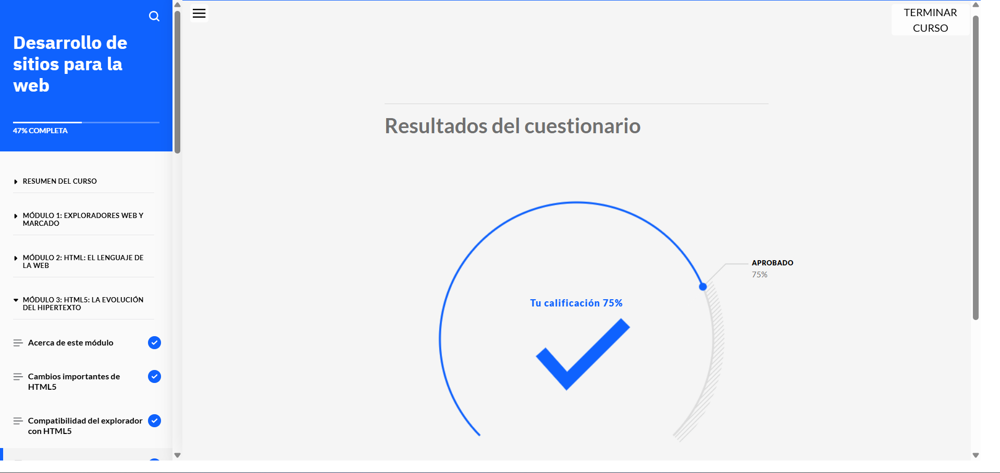
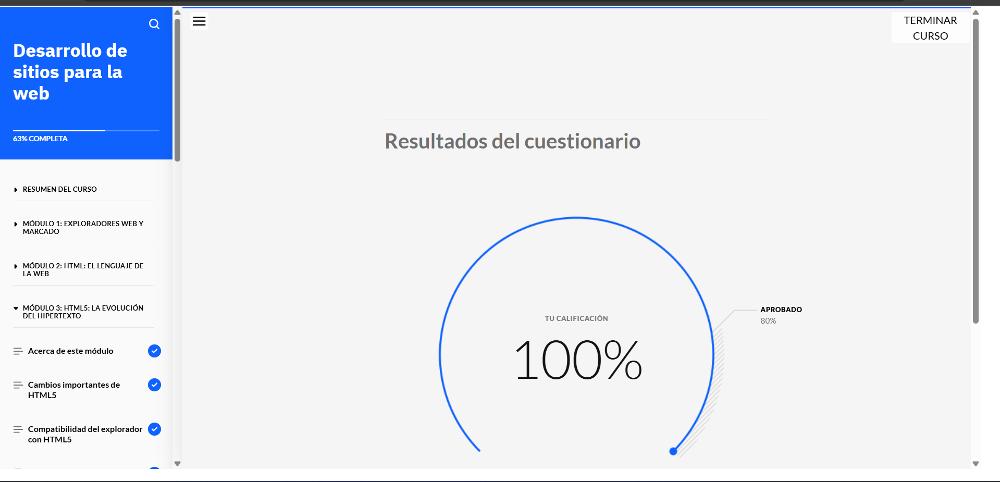
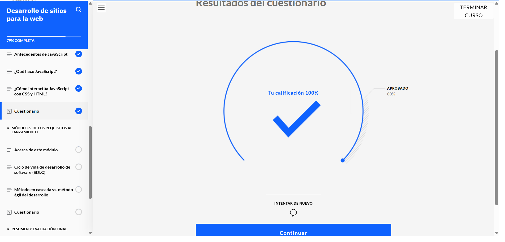
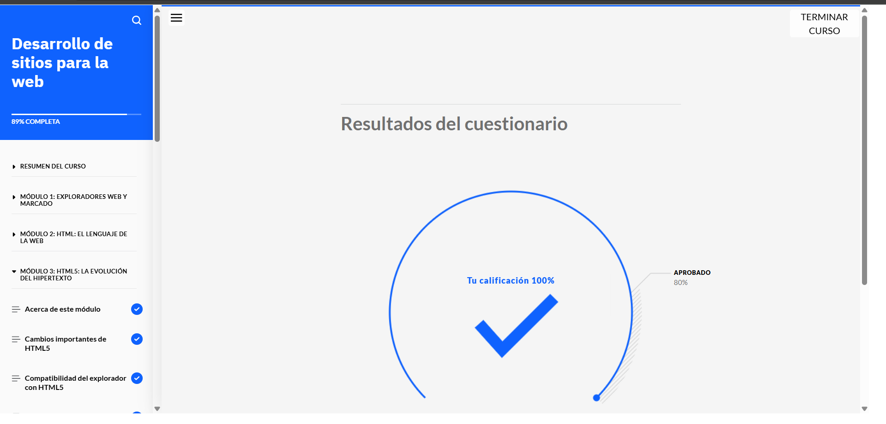
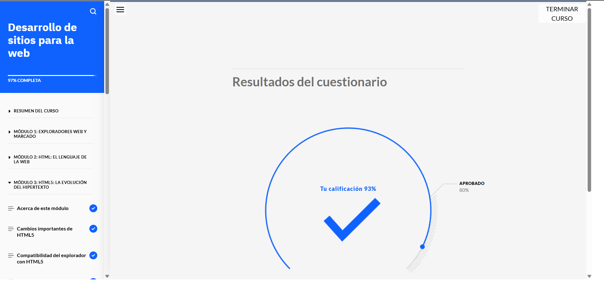
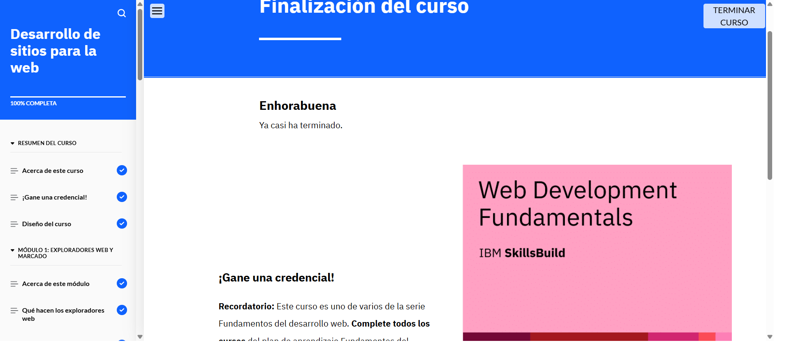

# Desarrollo de sitios para la web

## Acerca de esta actividad formativa

### Acerca de esta actividad de aprendizaje

En este curso, aprenderá cómo los desarrolladores web crean sitios web. Conocerá los lenguajes más comunes utilizados para el desarrollo web, como HTML, CSS y JavaScript, y cómo han evolucionado. También conocerá el ciclo de vida de desarrollo de software y de qué formas un enfoque ágil mejora el desarrollo web.

#### Lo que aprenderá

Después de completar este curso, debería ser capaz de:

- Identificar la finalidad de los exploradores web
- Describir los lenguajes de marcado y los desafíos que pueden superar
- Explicar la estructura, las funciones y la evolución del código HTML
- Identificar las mejoras que introdujo HTML5
- Explicar las características y funciones de CSS
- Explicar las características y funciones de JavaScript
- Identificar de qué formas JavaScript interactúa con CSS y HTML
- Identificar las fases del ciclo de vida de desarrollo de software (SDLC)
- Diferenciar entre el enfoque en cascada y el enfoque ágil del desarrollo
- Resaltar el marco Scrum

