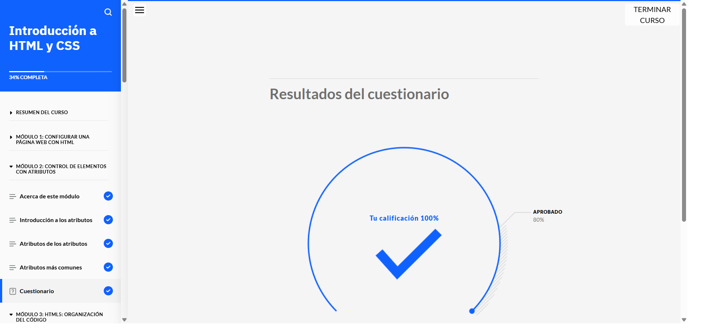
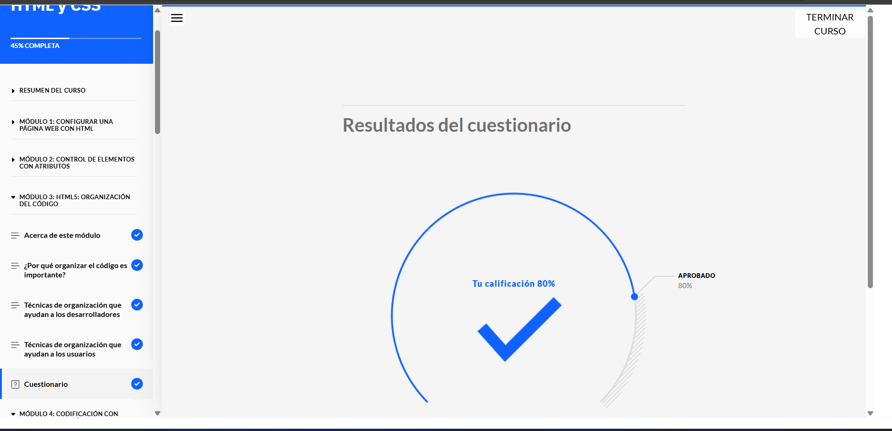
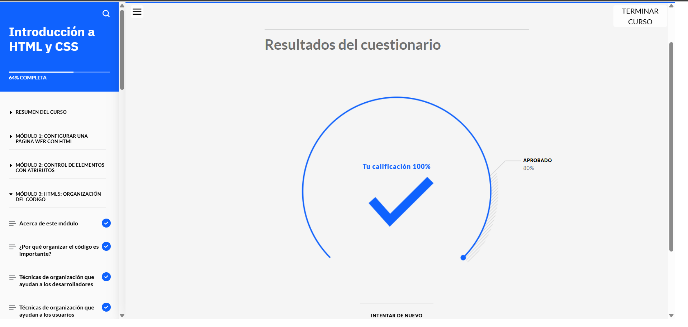
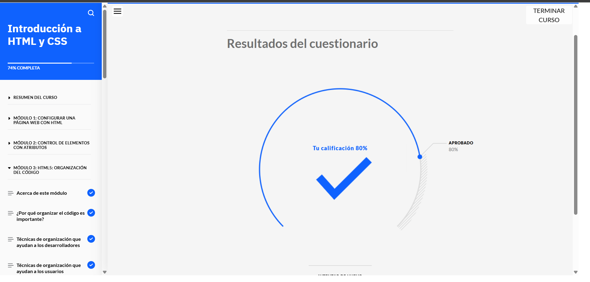
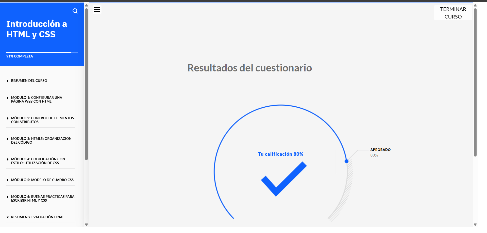
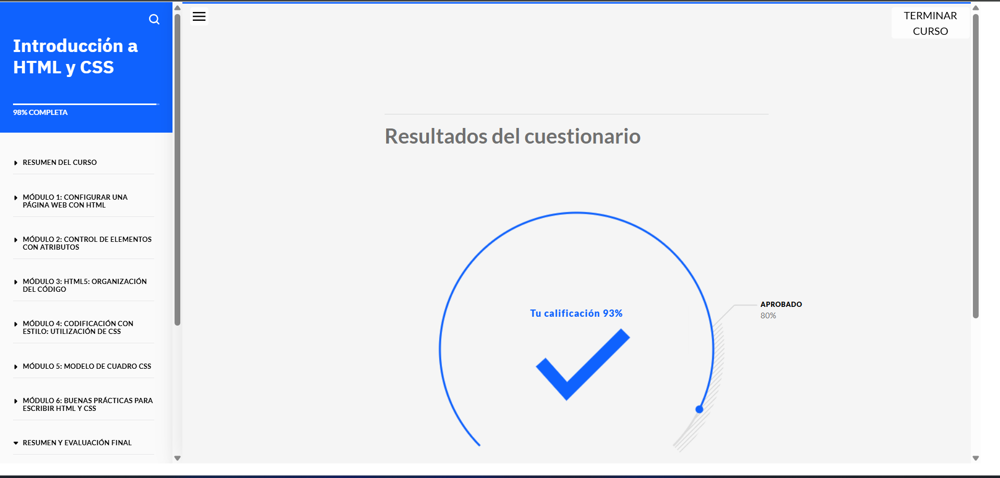
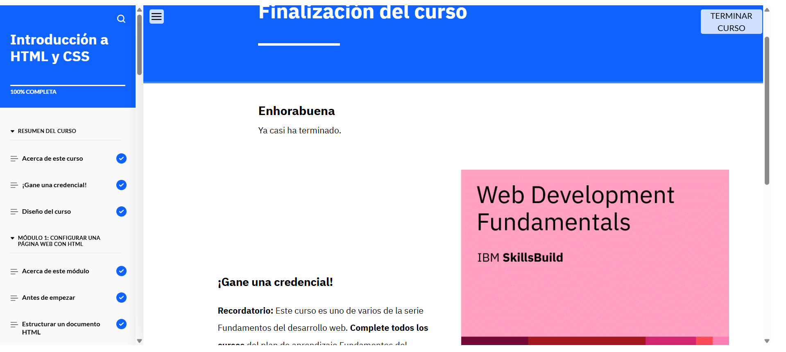

# Introducción a HTML y CSS

## Acerca de esta actividad formativa

## Acerca de esta actividad de aprendizaje

En este curso conocerá la estructura básica de un documento HTML y los elementos más comunes para la creación de una página web. Explorará los atributos HTML y comprenderá la importancia de organizar la información. Asimismo, conocerá CSS y explorará el modelo de cuadro CSS. Por último, conocerá las buenas prácticas que utilizan los desarrolladores web para escribir código HTML y CSS.

## Lo que aprenderá

Después de completar este curso, debería ser capaz de:

- Describir cómo los desarrolladores web utilizan elementos HTML para crear una página web
- Identificar y explicar los elementos HTML más comunes
- Definir los atributos y usos de HTML
- Identificar y explicar los atributos más comunes
- Identificar las técnicas para organizar el código que benefician a los desarrolladores y los usuarios web
- Describir los métodos y técnicas para aplicar CSS a HTML
- Describir el modelo de cuadro CSS y los componentes de los cuadros CSS
- Describir las buenas prácticas para escribir código HTML y CSS
- Describir las características principales de un entorno de desarrollo integrado (IDE) que ayudan a mejorar el flujo de trabajo de los desarrolladores web

