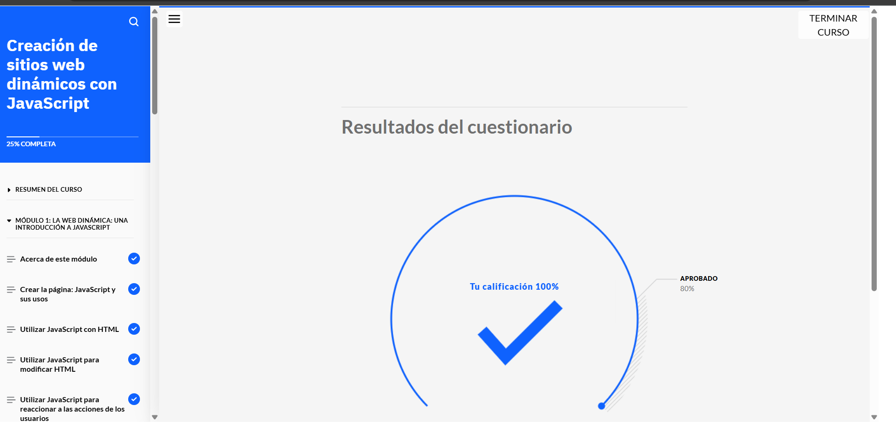
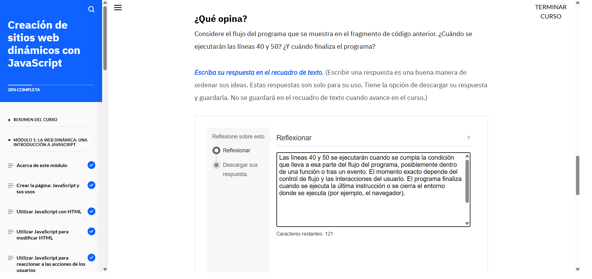
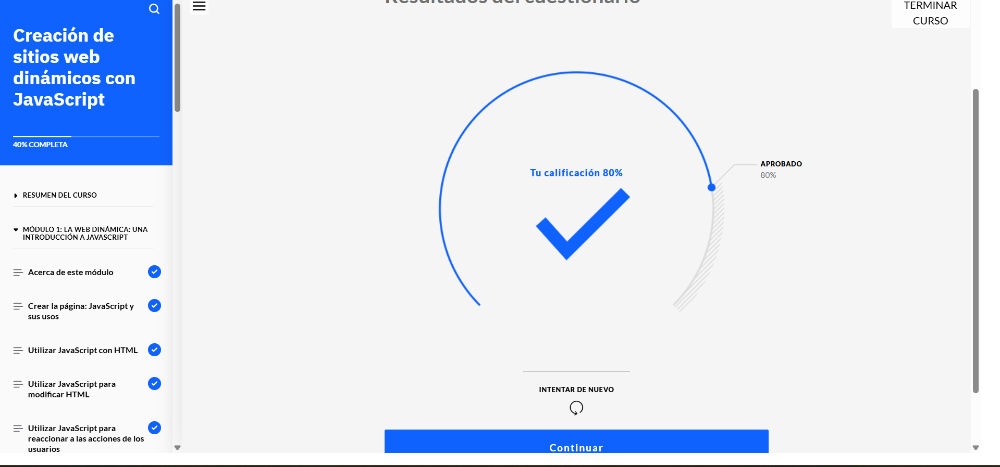
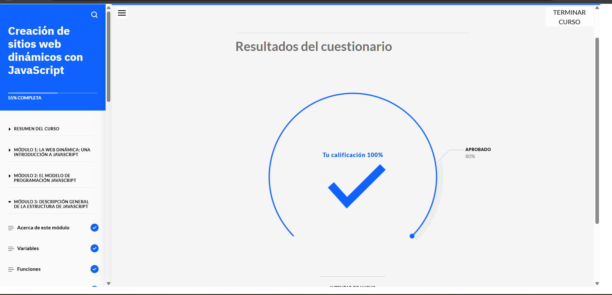
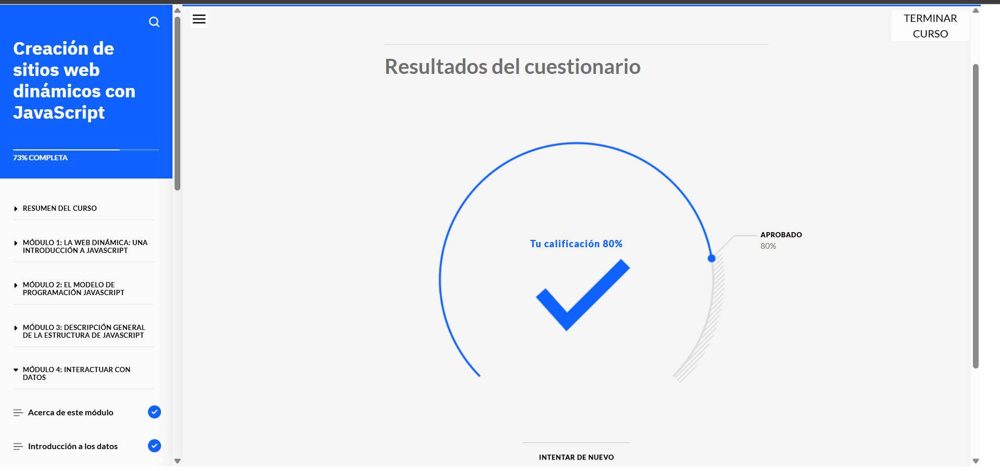
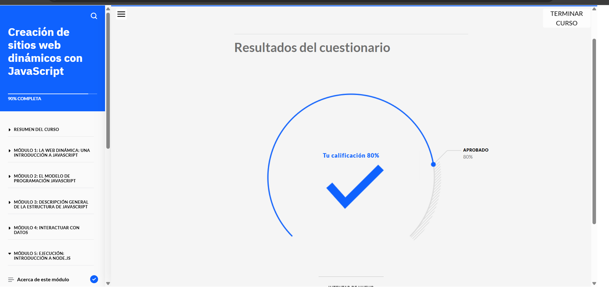
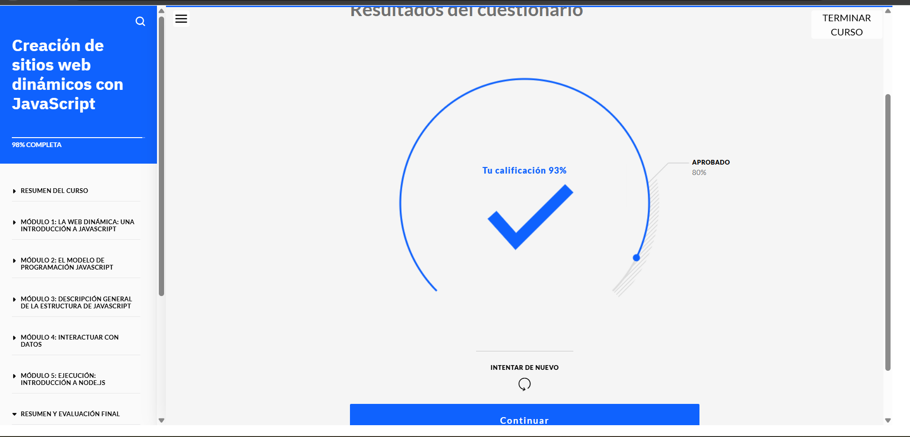
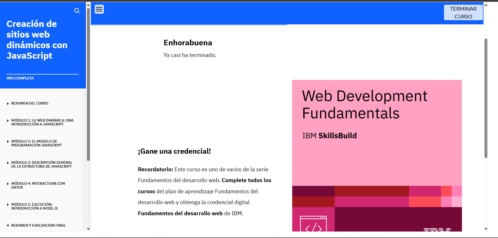

# Creación de sitios web dinámicos con JavaScript

## Acerca de esta actividad de aprendizaje

En este curso, aprenderá cómo los desarrolladores web utilizan JavaScript junto con HTML para crear sitios web dinámicos e interactivos. Explorará la sintaxis de JavaScript y comprenderá cómo funcionan las variables, las funciones, las expresiones y los sucesos en el código. Además, se adentrará en el uso de datos en sitios web y cómo trabajar con bases de datos utilizando MySQL. También se introducirá en Node.js y descubrirá las ventajas de utilizar marcos y bibliotecas en el desarrollo web.

## Lo que aprenderá

Al finalizar este curso, será capaz de:

- Explicar la sintaxis de JavaScript.
- Identificar las técnicas que los desarrolladores web utilizan para incluir JavaScript en HTML.
- Comparar y contrastar distintos modelos de programación.
- Explicar cómo utilizar objetos de código.
- Describir el funcionamiento de las variables, las funciones, las expresiones, los operadores y los sucesos en el código JavaScript para sitios web dinámicos.
- Identificar las cuatro funciones principales de una base de datos.
- Reconocer una sintaxis MySQL básica para crear una base de datos y trabajar con los datos.
- Explicar la finalidad y la función de Node.js.

## Requisitos previos

Antes de comenzar este curso, deberá tener conocimientos básicos sobre:

- Las funciones principales de un sistema y las capas de la arquitectura del sistema.
- La estructura de HTML, CSS y JavaScript.

Si aún no cuenta con estos conocimientos, puede adquirirlos completando los cursos **Aspectos básicos del desarrollo web** y **Desarrollo de sitios para la web**, que forman parte del plan de aprendizaje **Fundamentos del desarrollo web**.

## Contenido del curso

### 1. Introducción a JavaScript
- Historia y evolución de JavaScript.
- Cómo incluir JavaScript en un documento HTML.
- Diferencias entre JavaScript interno, externo e inline.

### 2. Fundamentos de JavaScript
- Sintaxis básica.
- Variables y tipos de datos.
- Operadores y expresiones.
- Funciones y su declaración.

### 3. Interactividad con JavaScript
- Eventos y su manejo.
- Manipulación del DOM (Document Object Model).
- Validación de formularios.

### 4. Trabajo con datos
- Introducción a MySQL.
- Operaciones básicas de bases de datos: Crear, Leer, Actualizar y Eliminar (CRUD).
- Conexión de JavaScript con bases de datos.

### 5. Introducción a Node.js
- ¿Qué es Node.js?
- Ventajas de usar Node.js en el desarrollo web.
- Instalación y configuración básica.
- Creación de un servidor básico con Node.js.

### 6. Uso de marcos y bibliotecas
- Introducción a frameworks populares como React, Angular y Vue.js.
- Beneficios de usar bibliotecas como jQuery.
- Comparación entre marcos y bibliotecas.

    