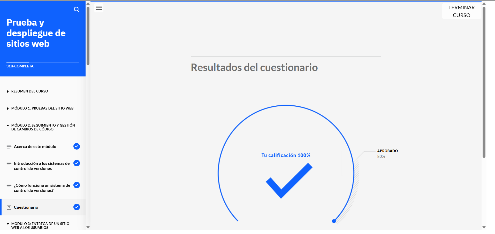

# Prueba y despliegue de sitios web

## Acerca de esta actividad de aprendizaje

En este curso, explorará cómo los desarrolladores prueban exhaustivamente el código de los sitios web antes de habilitar el acceso público a ellos. Descubrirá cómo los equipos utilizan sistemas de control de versiones para acelerar la entrega de nuevas características y funcionalidades a los usuarios. También conocerá las herramientas y los procesos que utilizan los desarrolladores para optimizar y simplificar el despliegue de los sitios web en sus servidores o en la nube.

## Lo que aprenderá

Después de completar este curso, será capaz de:

- Identificar distintos tipos de pruebas para sitios web y las áreas a probar.
- Describir las ventajas de las pruebas automatizadas.
- Explicar los sistemas de control de versiones para el desarrollo web.
- Identificar los pasos para publicar un sitio web.
- Diferenciar entre entrega continua y despliegue continuo.
- Describir la finalidad, los beneficios y el proceso de flujo de trabajo en el ciclo de vida de DevOps.
- Describir qué es el diseño reactivo y su importancia.
- Explicar la entrega de contenido web como un sitio web y la entrega de contenido web en una aplicación web.
- Diferenciar entre contenedores y máquinas virtuales.
- Identificar los métodos y las herramientas más comunes para probar y automatizar el despliegue de sitios web.
- Explicar la computación en la nube para el desarrollo y despliegue web.

## Requisitos previos

Antes de comenzar este curso, deberá tener conocimientos básicos sobre:

- Pruebas de software y su importancia en el desarrollo.
- Conceptos básicos de sistemas de control de versiones como Git.
- Fundamentos de diseño web y desarrollo de aplicaciones web.

Si aún no cuenta con estos conocimientos, puede adquirirlos completando los cursos **Aspectos básicos del desarrollo web** y **Desarrollo de sitios para la web**, que forman parte del plan de aprendizaje **Fundamentos del desarrollo web**.

## Contenido del curso

### 1. Introducción a las pruebas de sitios web
- Tipos de pruebas: funcionales, de rendimiento, de seguridad y de usabilidad.
- Herramientas para pruebas manuales y automatizadas.
- Importancia de las pruebas en el ciclo de vida del desarrollo web.

### 2. Sistemas de control de versiones
- Introducción a Git y GitHub.
- Flujo de trabajo básico: clonación, commits, ramas y fusiones.
- Resolución de conflictos y colaboración en equipo.

### 3. Publicación de sitios web
- Pasos para publicar un sitio web.
- Configuración de servidores web.
- Uso de servicios de alojamiento y despliegue en la nube.

### 4. Entrega y despliegue continuo
- Diferencias entre entrega continua y despliegue continuo.
- Herramientas populares como Jenkins, GitHub Actions y CircleCI.
- Automatización del flujo de trabajo de despliegue.

### 5. Introducción a DevOps
- ¿Qué es DevOps?
- Beneficios del enfoque DevOps en el desarrollo web.
- Ciclo de vida de DevOps: integración, entrega y monitoreo.

### 6. Diseño reactivo y entrega de contenido
- Principios del diseño web reactivo.
- Diferencias entre sitios web y aplicaciones web.
- Optimización de contenido para diferentes dispositivos.

### 7. Contenedores y máquinas virtuales
- Introducción a Docker y Kubernetes.
- Comparación entre contenedores y máquinas virtuales.
- Beneficios de la inclusión en contenedores para el desarrollo y despliegue.

### 8. Computación en la nube
- Conceptos básicos de computación en la nube.
- Servicios populares como AWS, Azure y Google Cloud.
- Ventajas de la nube para el desarrollo y despliegue web.

