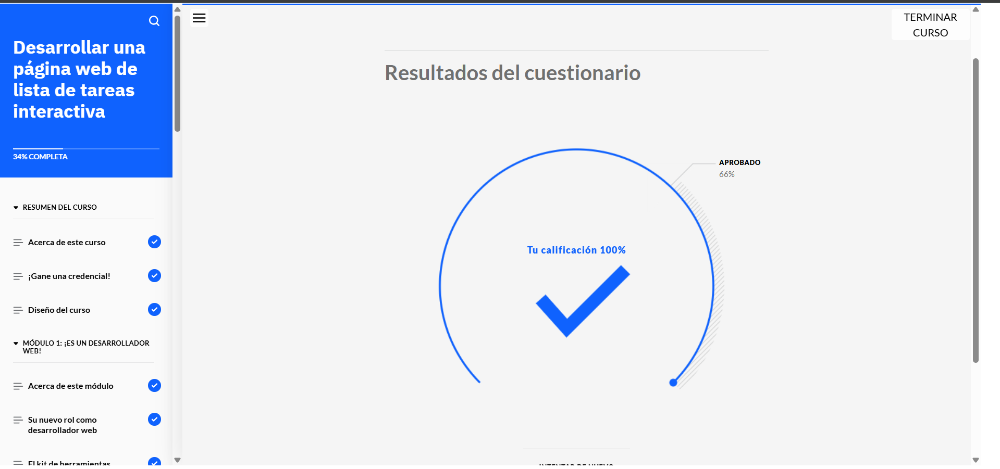
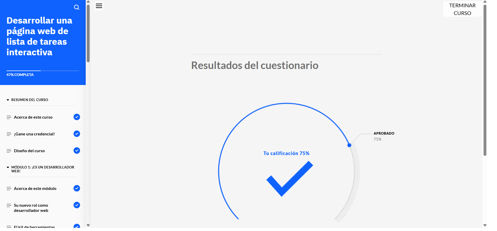
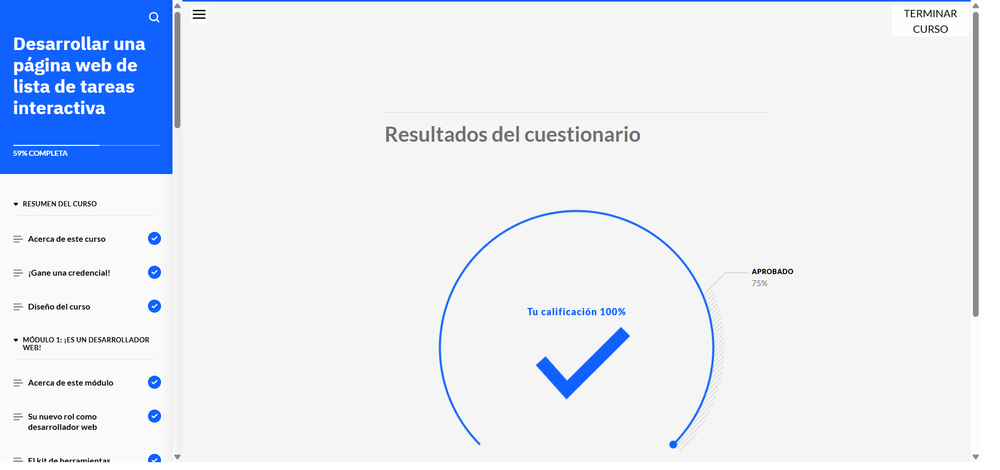
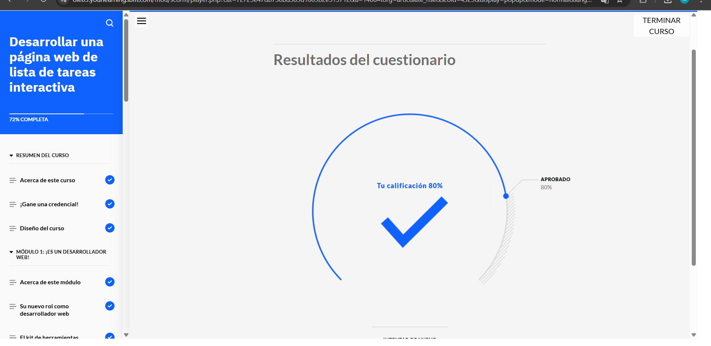
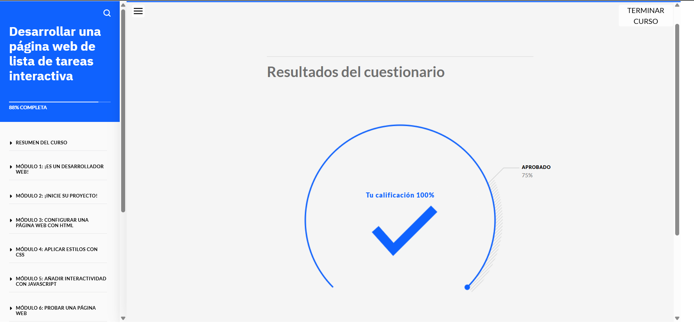
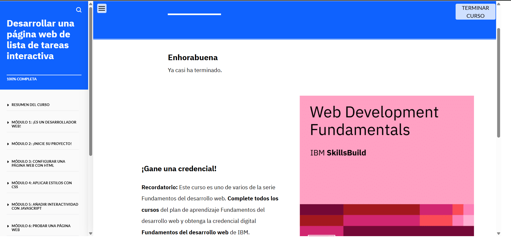

# Desarrollar una página web de lista de tareas interactive

## Actividad de Aprendizaje: Desarrollo de una Página Web Interactiva de Lista de Tareas

## Acerca de esta Actividad de Aprendizaje

En esta actividad de aprendizaje, tendrás la oportunidad de practicar el desarrollo completo de una página web interactiva centrada en una **lista de tareas**. A lo largo del curso, trabajarás en una serie de simulaciones diseñadas para guiarte paso a paso por el proceso de construcción de una aplicación web básica pero funcional.

Aprenderás a crear y gestionar archivos de código esenciales, construirás la estructura de la página web utilizando **HTML**, aplicarás estilos visuales con **CSS**, y agregarás funcionalidades interactivas mediante **JavaScript**. Finalmente, aprenderás cómo probar el funcionamiento de tu página web para asegurarte de que cumple con los objetivos definidos.

Este curso se enfoca en el **aprendizaje práctico**, por lo que desde el inicio estarás escribiendo y ejecutando código, enfrentándote a desafíos reales que simulan situaciones del desarrollo web cotidiano.

---

## Objetivos de Aprendizaje

Después de completar este curso, serás capaz de:

### 🔧 Identificar las herramientas y conocimientos necesarios
- Comprenderás las **herramientas fundamentales** utilizadas en el desarrollo web.
- Identificarás las tecnologías básicas: **HTML**, **CSS**, y **JavaScript**.
- Conocerás el uso de navegadores web como entornos de prueba y de inspección del comportamiento del sitio.
- Aprenderás sobre la importancia de un entorno de desarrollo integrado (**IDE**) para escribir, organizar y depurar código.

### 🧠 Revisar requisitos y wireframes
- Analizarás los **requisitos funcionales y no funcionales** de una página web.
- Interpretarás diagramas de **wireframes** que representan el diseño visual preliminar de la interfaz de usuario.
- Utilizarás estos recursos como guía para tomar decisiones sobre la estructura, diseño y flujo de trabajo del sitio.

### 💻 Utilizar Visual Studio Code como IDE
- Instalarás y configurarás **Visual Studio Code (VS Code)**, una de las herramientas más populares entre los desarrolladores web.
- Aprenderás a crear, organizar y gestionar carpetas y archivos de proyecto desde VS Code.
- Utilizarás extensiones útiles, como **Live Server**, para ver tus cambios en tiempo real.

### 🏗️ Crear una estructura HTML básica
- Comprenderás la sintaxis de HTML y su papel en la **estructura del contenido web**.
- Crearás etiquetas semánticas para organizar títulos, listas, botones y formularios.
- Implementarás una estructura lógica y clara que sirva de base para los estilos y comportamientos futuros.

### 🎨 Estilizar con CSS
- Escribirás reglas de estilo CSS para personalizar el aspecto visual de tu página.
- Aplicarás estilos a través de selectores, clases y pseudoclases.
- Utilizarás conceptos como el modelo de caja, colores, tipografías, márgenes, paddings, y diseño responsive.

### ⚙️ Añadir interactividad con JavaScript
- Aprenderás los fundamentos del lenguaje JavaScript.
- Escribirás funciones que respondan a **eventos del usuario**, como hacer clic en un botón o escribir en un campo.
- Implementarás la lógica necesaria para **añadir, eliminar y marcar tareas como completadas**.

### ✅ Realizar pruebas funcionales simples
- Probarás el comportamiento de tu página web verificando que todas las funcionalidades trabajen según lo previsto.
- Detectarás y corregirás errores comunes en el código.
- Validarás que la experiencia de usuario sea coherente y satisfactoria.

---

## Herramientas que Utilizarás

- **Visual Studio Code (VS Code)**: entorno de desarrollo.
- **HTML5**: lenguaje de marcado.
- **CSS3**: hojas de estilo en cascada.
- **JavaScript (ES6+)**: lenguaje de programación para la web.
- **Live Server**: extensión para previsualizar en vivo la página web.
- **Consola del navegador**: para depuración y pruebas.

---

## Resultado Final Esperado

Al finalizar esta actividad, habrás creado una **aplicación web de lista de tareas** con las siguientes características:

- Interfaz amigable y bien estructurada.
- Capacidad para **añadir nuevas tareas**.
- Funcionalidad para **marcar tareas como completadas**.
- Posibilidad de **eliminar tareas** individualmente.
- Diseño limpio, estilizado y responsive.
- Código organizado y funcional, siguiendo buenas prácticas.

---

