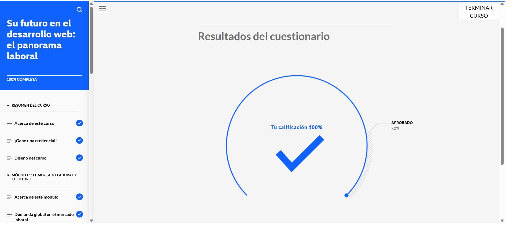
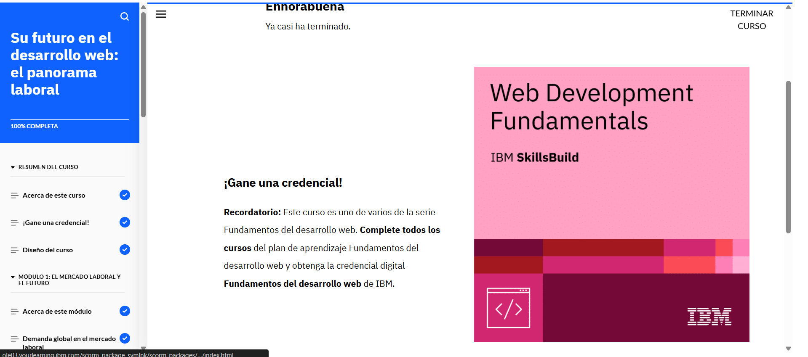

# Su futuro en el desarrollo web: el panorama laboral

## Acerca de esta actividad de aprendizaje

En este curso, explorará el mercado laboral del desarrollo web, las competencias esenciales que los desarrolladores necesitan para tener éxito y cómo interactúan con otros roles profesionales dentro de un equipo. También se le proporcionarán recursos y oportunidades de aprendizaje continuo para que pueda mantenerse actualizado en este campo en constante evolución.

## Lo que aprenderá

Después de completar este curso, será capaz de:

- Identificar los sectores en los que trabajan los desarrolladores web.
- Reconocer la demanda global de profesionales del desarrollo web en el mercado laboral.
- Analizar el futuro del campo del desarrollo web.
- Identificar los roles y las especialidades más comunes en el campo del desarrollo web.
- Explicar las responsabilidades principales de los distintos roles del desarrollo web.
- Identificar las competencias que necesitan los desarrolladores web.
- Distinguir entre los distintos roles de un equipo de desarrollo web.
- Identificar recursos para aprender más y estar siempre al día en el campo del desarrollo web.

## Requisitos previos

Antes de comenzar este curso, se recomienda tener conocimientos básicos sobre:

- Fundamentos del desarrollo web, incluyendo HTML, CSS y JavaScript.
- El ciclo de vida del desarrollo de software.
- Experiencia básica trabajando en equipos o proyectos colaborativos.

Si aún no cuenta con estos conocimientos, puede adquirirlos completando los cursos **Aspectos básicos del desarrollo web** y **Desarrollo de sitios para la web**, que forman parte del plan de aprendizaje **Fundamentos del desarrollo web**.

## Contenido del curso

### 1. Introducción al mercado laboral del desarrollo web
- Sectores principales donde los desarrolladores web desempeñan un papel clave (tecnología, comercio electrónico, educación, salud, entre otros).
- Análisis de la demanda global de desarrolladores web.
- Tendencias actuales y futuras del mercado laboral.

### 2. Roles y especialidades en el desarrollo web
- Roles comunes: desarrollador front-end, back-end, full-stack, diseñador UX/UI, administrador de bases de datos.
- Especialidades emergentes: desarrollador de aplicaciones móviles, especialista en accesibilidad web, ingeniero DevOps.
- Responsabilidades principales de cada rol.

### 3. Competencias esenciales para desarrolladores web
- Habilidades técnicas: lenguajes de programación, frameworks, bases de datos, control de versiones.
- Habilidades blandas: comunicación, trabajo en equipo, resolución de problemas, adaptabilidad.
- Importancia de la actualización constante en un campo en evolución.

### 4. Trabajo en equipo en el desarrollo web
- Estructura típica de un equipo de desarrollo web.
- Roles complementarios: gerentes de proyecto, analistas de negocio, diseñadores gráficos, especialistas en marketing digital.
- Cómo colaborar eficazmente en equipos multidisciplinarios.

### 5. Recursos y aprendizaje continuo
- Plataformas de aprendizaje en línea: cursos, tutoriales y certificaciones.
- Comunidades y foros de desarrolladores: GitHub, Stack Overflow, Reddit.
- Conferencias, webinars y eventos de la industria.
- Blogs y podcasts especializados en desarrollo web.

