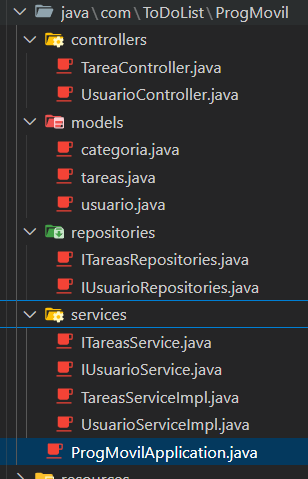
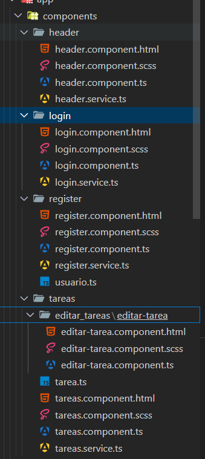
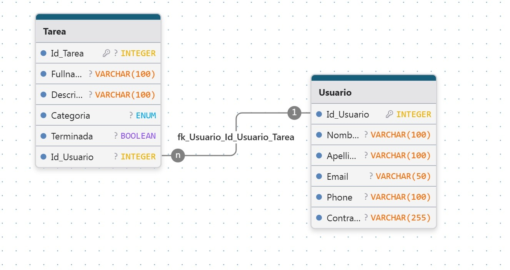

# 📝 Documemtación del proyecto TO-DO APP


## 1. 📌 Planteamiento del Problema

Las personas a menudo tienen dificultades para organizar sus actividades diarias, lo que puede generar olvidos, baja productividad y desorden personal. 

Si bien existen aplicaciones para gestión de tareas, muchas son complejas o requieren una curva de aprendizaje elevada, lo cual puede desmotivar a usuarios que solo buscan una solución sencilla.

---

## 2. 🎯 Objetivos del Sistema

### 🎯 Objetivo General

Diseñar y desarrollar una **aplicación móvil intuitiva** que permita a los usuarios **crear, editar, eliminar, categorizar y marcar tareas como completadas**, contribuyendo a una mejor organización personal.

### 🎯 Objetivos Específicos

- ✅ Permitir el **registro e inicio de sesión** de usuarios.
- ✅ Gestionar tareas básicas: **creación, edición y eliminación**.
- ✅ Permitir **crear tareas según su categoría**.
- ✅ Permitir **marcar tareas como completadas**.
- ✅ Mantener una **interfaz clara, simple y amigable** para el usuario.

---

## 3. ⚙️ Requerimientos del Sistema

### 3.1 ✅ Requerimientos Funcionales

- **RF01:** El sistema debe permitir el **registro de nuevos usuarios**.
- **RF02:** El sistema debe permitir el **inicio de sesión de usuarios registrados**.
- **RF03:** El usuario debe poder **crear, editar y eliminar tareas**.
- **RF04:** El usuario debe poder **asignar una categoría a cada tarea**.
- **RF05:** El usuario debe poder **marcar tareas como completadas**.

### 3.2 🚀 Requerimientos No Funcionales

- **RNF01:** El sistema debe ser accesible desde **dispositivos móviles Android**.
- **RNF02:** La información del usuario debe ser **almacenada de forma segura**.
- **RNF03:** La comunicación entre frontend y backend debe realizarse vía **API REST segura (HTTPS)**.
- **RNF04:** La interfaz debe ser **simple, limpia e intuitiva**.
- **RNF05:** La aplicación debe ofrecer **tiempos de respuesta menores a 2 segundos por operación**.

---

## 📱 Resultado Esperado

Una aplicación móvil funcional, ligera y fácil de usar que permita a los usuarios mantener un mejor control sobre sus tareas diarias, aumentando así su productividad y bienestar personal.

## 4. 🧩 Estructura técnica del sistema
| Componente            | Tecnología                                   |
|-----------------------|----------------------------------------------|
| **Frontend (App Móvil)**  | Angular + Ionic (TypeScript, HTML, CSS)       |
| **Backend (API REST)**    | Spring Boot (Java 17)                        |
| **Base de Datos**         | MySQL                                       |
| **Control de versiones**  | GitHub                                      |
| **Entorno de desarrollo** | Visual Studio Code                          |

---

## 5. Arquitectura del proyecto
### Backend



### Frontend


---

## 6. Diagramas

### Modelo Entidad-Relación(MER)


### Modelo Relacional(MR)

```sql
-- Crear tabla Usuario
CREATE TABLE Usuario (
    Id_Usuario SERIAL PRIMARY KEY,
    Nombre VARCHAR(255) NOT NULL,
    Apellido VARCHAR(255) NOT NULL,
    Email VARCHAR(255) UNIQUE NOT NULL,
    Phone VARCHAR(255),
    Contraseña VARCHAR(255) NOT NULL
);

-- Crear tabla Tarea
CREATE TABLE Tarea (
    Id_Tarea SERIAL PRIMARY KEY,
    Fullname VARCHAR(255) NOT NULL,
    Descripcion VARCHAR(255),
    Categoria VARCHAR(50) NOT NULL,
    Terminada BOOLEAN DEFAULT FALSE,
    Id_Usuario INTEGER
);

-- Agregar la llave foránea con nombre personalizado
ALTER TABLE Tarea
ADD CONSTRAINT fk_tarea_usuario
FOREIGN KEY (Id_Usuario)
REFERENCES Usuario(Id_Usuario);
```