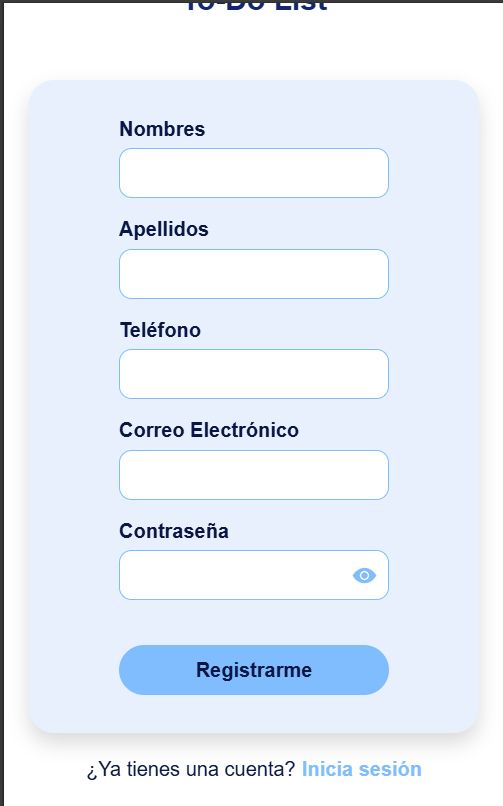

# 03-HU: Registro de usuario
## Descripción

Esta historia de usuario tiene como objetivo permitir a los nuevos usuarios registrarse en el sistema proporcionando sus datos personales. 

> _"Como usuario nuevo del sistema, quiero poder registrarme proporcionando mis datos personales, para poder acceder posteriormente al sistema y utilizar sus funcionalidades."_

Este registro será la puerta de entrada a otras funcionalidades del sistema, como iniciar sesión, acceder a servicios personalizados, entre otros.

## Funcionalidades

- Formulario de registro accesible desde la interfaz principal.
- Campos requeridos: nombre completo, correo electrónico, contraseña.
- Validación de formato y unicidad del correo.
- Validación de contraseña (mínimo de caracteres).
- Mensajes de error amigables y específicos.

