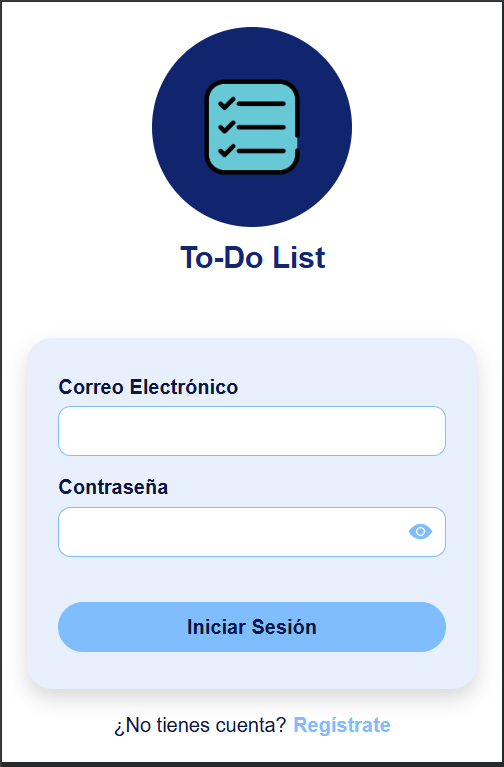

# Funcionalidad: Inicio de Sesión de Usuario

## 📌 Descripción

Como **usuario registrado**, quiero poder iniciar sesión ingresando mi **correo electrónico** y **contraseña**, con el objetivo de **acceder al sistema utilizando mis credenciales personales**.

Esta funcionalidad es parte esencial del sistema, ya que habilita el acceso seguro a la aplicación únicamente a usuarios previamente registrados y autenticados.

---

## ✅ Criterios de Aceptación

Para que esta funcionalidad sea considerada como completa, debe cumplir con los siguientes criterios:

1. 🔐 **Formulario de autenticación:**
   - Debe incluir dos campos de entrada:
     - **Correo electrónico** (`email`)
     - **Contraseña** (`password`)

2. 🧠 **Validación de credenciales:**
   - El sistema debe verificar que los datos ingresados correspondan a un usuario registrado en la base de datos.

3. ✔️ **Inicio de sesión exitoso:**
   - Si las credenciales son válidas:
     - El sistema debe **iniciar sesión** correctamente.
     - El usuario debe ser **redirigido** al **panel principal** o **página de inicio** de la aplicación.

4. ❌ **Credenciales inválidas:**
   - Si las credenciales no son válidas:
     - Se debe mostrar un **mensaje de error claro y genérico**, como por ejemplo:  
       `Credenciales inválidas. Por favor, verifique e intente nuevamente.`
     - **No debe revelarse información** sobre si el correo o la contraseña es incorrecta para mantener la seguridad del sistema.

---

### 🖥️ Frontend

- [x] El **formulario de login está implementado y visible** en la aplicación.
- [x] Se realiza la **validación de los campos de entrada**:
  - El campo de correo electrónico debe tener un **formato válido**.
  - Ninguno de los campos puede estar vacío.
- [x] Se gestiona la redirección al **panel principal** tras el login exitoso.
- [x] Se muestra un mensaje de error **claro y genérico** si el login falla.

### 🔧 Backend

- [x] El sistema **verifica correctamente las credenciales del usuario**.
- [x] Si son válidas, se devuelve una **respuesta segura**:
  - Por ejemplo, un **token JWT** o una **cookie de sesión**.
- [x] Si son inválidas, se retorna una **respuesta de error controlada**.
- [x] El sistema **no revela información sensible** en los mensajes de error.

## 🚀 Resultado Esperado

El flujo final debe garantizar una experiencia de usuario fluida, rápida y segura, donde solo los usuarios registrados pueden acceder a su cuenta, con feedback claro en caso de error y protección contra vulnerabilidades comunes.

