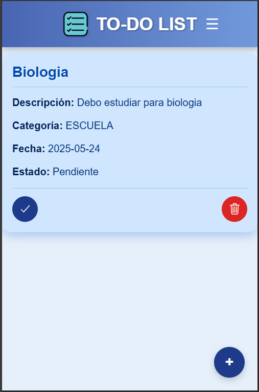
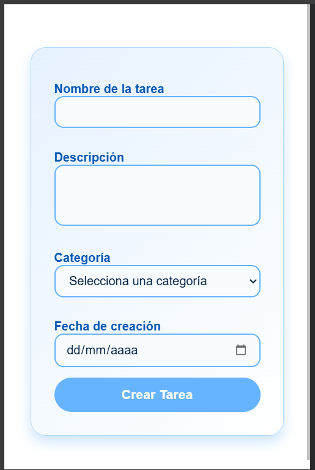
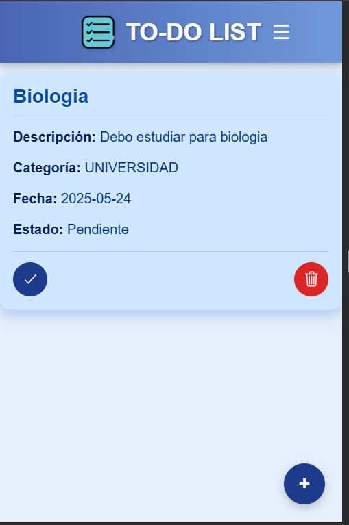

# Funcionalidad: Gestión de Tareas

## 📌 Descripción

Como **usuario de la aplicación**, quiero poder **crear, editar y eliminar tareas**, con el objetivo de **mantener mi lista de pendientes organizada y actualizada diariamente**.

Esta funcionalidad es central en la aplicación, ya que permite al usuario llevar un control personal de sus responsabilidades diarias, asegurando una mejor gestión del tiempo y productividad.

---

## ✅ Criterios de Aceptación

Para que esta funcionalidad sea considerada como completa, debe cumplir con los siguientes criterios:

1. 📝 **Creación de tareas:**
   - El usuario puede ingresar:
     - **Título** de la tarea.
     - **Descripción** detallada de la tarea.
   - Al guardar, la nueva tarea debe aparecer **de inmediato** en la lista.

2. ✏️ **Edición de tareas:**
   - El usuario puede seleccionar una tarea existente.
   - Puede modificar su **título** o **descripción**.
   - Al guardar los cambios, la tarea debe **actualizarse correctamente** en la lista.

3. 🗑️ **Eliminación de tareas:**
   - El usuario puede eliminar cualquier tarea desde la lista.
   - Se debe solicitar **confirmación** antes de eliminarla.
   - Una vez confirmada, la tarea debe **desaparecer** de la lista.

4. ⚠️ **Validaciones y mensajes:**
   - Si se intenta guardar una tarea con **campos vacíos**, se debe mostrar un **mensaje de error claro**.
   - Los mensajes de confirmación y errores deben ser **visibles y comprensibles**.

---

### 🖥️ Frontend

- [x] El **formulario de tareas está implementado y accesible** desde la interfaz.
- [x] Se permite la **creación de tareas** con título y descripción obligatorios.
- [x] Las tareas creadas aparecen **automáticamente** en la lista visible.
- [x] El usuario puede **editar una tarea existente** y ver los cambios reflejados de inmediato.
- [x] Se permite **eliminar tareas** luego de una confirmación visual.
- [x] Se muestran **mensajes de error o confirmación** claros para acciones como guardar, editar o eliminar.

### 🔧 Backend

- [x] El sistema permite **crear nuevas tareas** y las guarda correctamente en la base de datos.
- [x] Las tareas se pueden **modificar**, y los cambios se persisten correctamente.
- [x] El backend permite **eliminar tareas** de forma segura y controlada.
- [x] Se gestionan correctamente los **mensajes de error** en caso de datos inválidos u operaciones fallidas.

---

## 🚀 Resultado Esperado

El flujo final debe garantizar una experiencia de usuario **fluida, intuitiva y confiable**, en la que las tareas puedan ser gestionadas de forma sencilla, permitiendo al usuario mantener una lista clara de lo que debe hacer.

---

---

