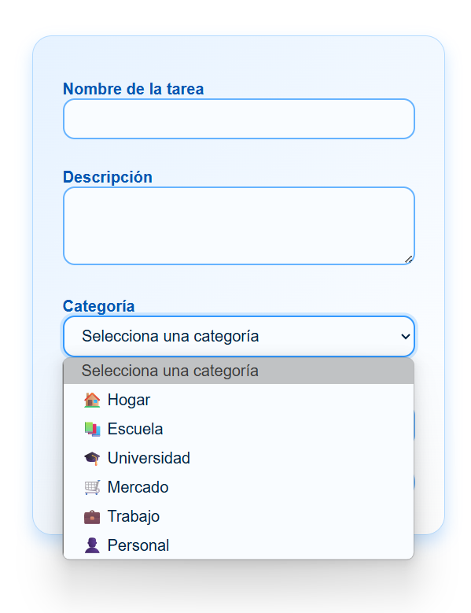

# Funcionalidad: Asignación de Categorías a Tareas

## 📌 Descripción

Como **usuario de la aplicación**, quiero poder **asignar una categoría a cada tarea**, con el objetivo de **organizar mejor mis pendientes diarios** y facilitar su clasificación según el tipo de actividad.

Esta funcionalidad complementa la gestión de tareas, permitiendo al usuario establecer un contexto para cada pendiente (por ejemplo: trabajo, personal, estudio), lo que mejora la productividad y el enfoque.

---

## ✅ Criterios de Aceptación

Para que esta funcionalidad sea considerada como completa, debe cumplir con los siguientes criterios:

1. 🗂️ **Selección de categoría:**
   - Al crear o editar una tarea, el usuario debe poder seleccionar una **categoría predefinida**.
   - Las categorías iniciales pueden incluir:
     - **Personal**
     - **Trabajo**
     - **Estudio**

2. 📋 **Campo visible para la selección:**
   - La selección de categoría debe presentarse en un **campo desplegable (select)** o un **componente visual intuitivo** y accesible.

3. 💾 **Persistencia de datos:**
   - Al guardar la tarea, la **categoría seleccionada debe almacenarse correctamente** en el sistema.

4. 🏷️ **Visualización clara:**
   - En la lista de tareas, cada tarea debe mostrar su **categoría asignada de forma clara**, ya sea como texto, ícono o etiqueta visual.

---

### 🖥️ Frontend

- [x] El formulario de creación/edición de tareas incluye un **selector de categoría** visible y funcional.
- [x] El usuario puede elegir entre una lista predefinida de categorías.
- [x] La categoría seleccionada se muestra junto con la tarea en la lista.
- [x] Se pueden editar las tareas y actualizar la categoría correctamente.
- [x] Se aplican estilos visuales (etiquetas, colores, íconos) para identificar la categoría de forma rápida.

### 🔧 Backend

- [x] El sistema **recibe, valida y guarda** correctamente la categoría asignada a cada tarea.
- [x] Las tareas devueltas desde el backend incluyen su categoría correspondiente.
- [x] Se gestiona correctamente la actualización de categorías en tareas existentes.

---

## 🚀 Resultado Esperado

El flujo debe permitir que cada tarea esté claramente identificada por una categoría, facilitando al usuario su organización y visualización. El uso de etiquetas o marcadores debe brindar **claridad inmediata** sobre el tipo de tarea, y la selección de categorías debe ser **fácil y rápida** al crear o editar.

Esta funcionalidad contribuye a una **experiencia de usuario más organizada**, ayudando a segmentar las responsabilidades y a mejorar la gestión del tiempo.

