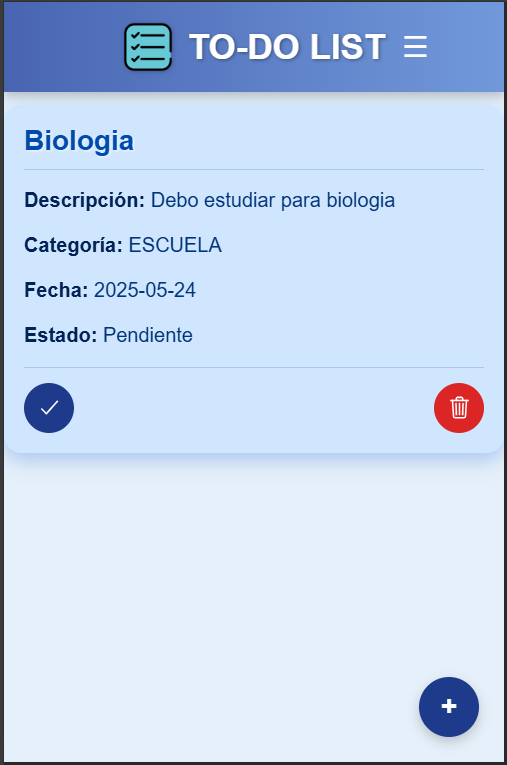

# Funcionalidad: Marcar Tareas como Completadas

## 📌 Descripción

Como **usuario de la aplicación**, quiero poder **marcar una tarea como completada**, para llevar un control de lo que ya he terminado.

Esta funcionalidad es esencial para la gestión de tareas, ya que permite distinguir rápidamente entre lo que ya se ha hecho y lo que aún está pendiente.

---

## ✅ Criterios de Aceptación

Para que esta funcionalidad sea considerada como completa, debe cumplir con los siguientes criterios:

1. ✅ **Opción visible para completar tareas:**
   - Cada tarea debe tener una opción claramente visible (como un **checkbox** o un **ícono**) para marcarla como completada.

2. 🎯 **Indicador visual de tarea completada:**
   - Una vez marcada como completada, la tarea desaparacerá de la lista.

---

### 🖥️ Frontend

- [x] Cada tarea en la lista tiene un **checkbox o ícono** accesible para marcarla como completada.
- [x] Al marcar la tarea, se elimira de la lista.

### 🔧 Backend

- [x] El sistema **recibe y guarda** el estado de la tarea (completada o no completada).
- [x] Al recuperar las tareas, el estado de completado se refleja correctamente.
- [x] Se garantiza la **persistencia del estado** incluso tras recargar la aplicación o cambiar de vista.

---

## 🚀 Resultado Esperado

El usuario debe poder llevar un control claro de su progreso marcando las tareas completadas. Esta acción debe ser **intuitiva, rápida y visualmente clara**, ayudando a mejorar la gestión del tiempo y a fomentar el sentido de logro.

